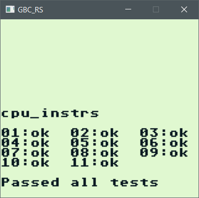
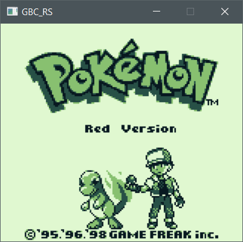

# gbc_rs

A GameBoy Color emulator written in the Rust programming language.
The purpose of this emulator is solely for me to learn Rust and to learn about how to write emulators.

This emulator is in development and is far from complete. So far it has basic functionality and can run DMG games using MBC1 and MBC3.

### Build & Run

* Install [SDL2](https://github.com/AngryLawyer/rust-sdl2)
* `cargo run --release rom.gb`

### Controls

| GameBoy button  | Keyboard      |
| --------------- | ------------- |
| A               | Left Alt      |
| B               | Left Control  |
| Start           | Return        |
| Select          | Right Shift   |
| Up              | Up            |
| Down            | Down          |
| Left            | Left          |
| Right           | Right         |

### Resources used
- [Zilog Z80 user manual](http://www.zilog.com/docs/z80/um0080.pdf)
- [Game Boy Programming Manual](http://www.romhacking.net/documents/544/)
- [Pan Docs](http://bgb.bircd.org/pandocs.htm)
- [blargg's gb tests](http://gbdev.gg8.se/files/roms/blargg-gb-tests/)
- [gbdev wiki](http://gbdev.gg8.se/wiki/articles/Main_Page) 
- [LR35902 opcode table](http://pastraiser.com/cpu/gameboy/gameboy_opcodes.html)
- [BGB and its excellent debugger](http://bgb.bircd.org/)
